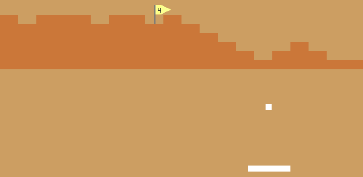

# *Indie Bungle 2: Breakout Indies*

# [Play Online](https://www.pippinbarr.com/indie-bungle-2-breakout-indies/) (desktop and mobile)

## Description
*Independent games! Cloned! In a way! All the fun with none of the features! Hot topics! ‘Sex’! ‘Death’! ‘Art’! ‘Alternate Dimensions’! ‘Golf’! Bricks! Balls! Paddles! Breakout!*

_Indie Bungle 2:_Breakout Indies__ was written in JavaScript/HTML5 using the [Phaser](http://phaser.io/) game framework. Sounds were created using bfxr, Audacity, the Mac OS X text-to-speech voice &#8220;Bad News&#8221;, as well as sound assets from _[VVVVVV](http://thelettervsixtim.es)_ and _[How Do You Do It?](http://ninasays.so/howdoyoudoit/)_. Graphics were created by me except for assets taken from _[VVVVVV](http://thelettervsixtim.es)_, _[How Do You Do It?](http://ninasays.so/howdoyoudoit/)_, and replicated from _[Desert Golfing](http://desertgolfing.captain-games.com/)_. Lyrics to Acid on Granite taken from Tale of Tales&#8217; _[The Graveyard](http://tale-of-tales.com/TheGraveyard/)_. Gameplay &#8220;translated&#8221; from the original games: _[Desert Golfing](http://desertgolfing.captain-games.com/)_, _[How Do You Do It?](http://ninasays.so/howdoyoudoit/)_, _[The Graveyard](http://tale-of-tales.com/TheGraveyard/)_, _[The Artist Is Present](http://www.pippinbarr.com/games/theartistispresent/TheArtistIsPresent.html)_, and _[VVVVVV](http://thelettervsixtim.es)_. _Indie Bungle 2__: _Breakout Indies__ should hopefully work on mobile.

## Documentation
* Read the [Process Documentation](../process)
* Look at the [Code Repository](https://github.com/pippinbarr/indie-bungle-2-breakout-indies) for source code etc.

## Press
Read the [Press Kit](../press) for press information

* [Kill Screen](https://killscreen.com/articles/what-if-all-videogames-were-breakout/)
* [Warp Door](http://warpdoor.com/).

## License
*Indie Bungle 2: Breakout Indies* is licensed under a [Creative Commons Attribution-NonCommercial 3.0 Unported License](http://creativecommons.org/licenses/by-nc/3.0/).
