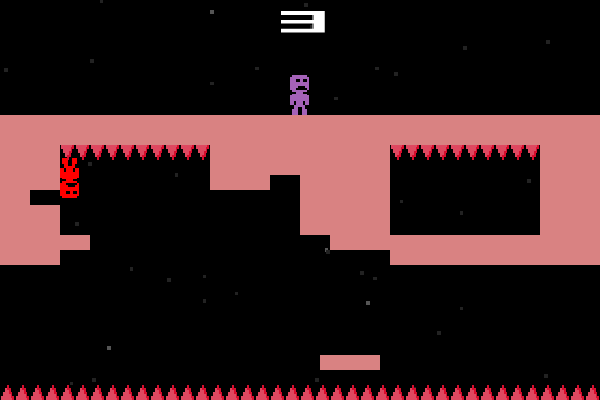
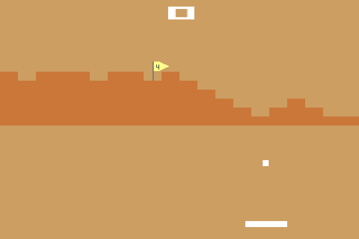
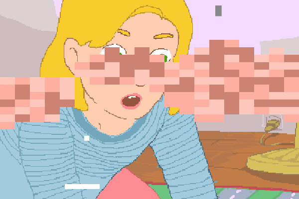
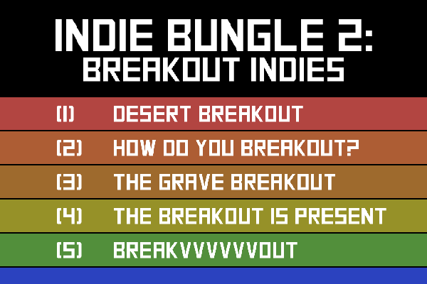
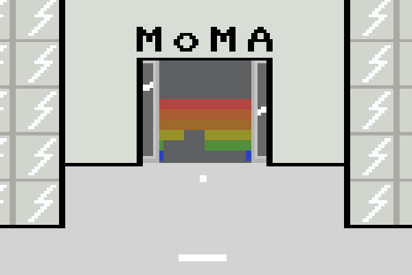
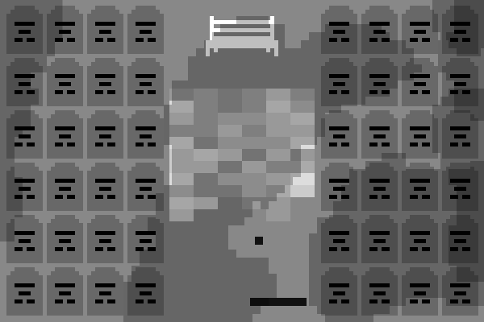

# *Indie Bungle 2: Breakout Indies*

## Information
* Released: 22 January 2016
* Website: http://www.pippinbarr.com/
* Platforms: Browser
* Link: https://www.pippinbarr.com/indie-bungle-2-breakout-indies/info
* Price: Free.

## Description
Independent games! Cloned! In a way! All the fun with none of the features! Hot topics! ‘Sex’! ‘Death’! ‘Art’! ‘Alternate Dimensions’! ‘Golf’! Bricks! Balls! Paddles! Breakout!

## History
The Indie Bungle 2 is a sequel of sorts to the Mumble Indie Bungle (2013). Specifically it is another take on the idea of "bungling" in game design. Where the Mumble Indie Bungle took as its premise that a shitty cloning company had misheard the names of the games it was cloning and careened off in bizarre directions, the Indie Bungle 2 revolves around the idea of a shitty cloning company that only has the technology to make versions of Atari's Breakout and must clone popular indie games through with that platform. Although the games generally look ludicrous and feel silly, rather a lot of thought has gone into how one can "translate" a given videogame into the language of another, with each of the games addressed providing separate and interesting challenges.

## Features
* "Sex"!
* "Death"!
* "Art"!
* "Alternate Dimensions"!
* "Golf"!

## Images

## Trailer
[View the Trailer on YouTube](https://www.youtube.com/watch?v=Ph45_48kVts)

## Links
* [The Real How Do You Do It?](http://ninasays.so/howdoyoudoit)
* [The Real Desert Golfing](http://desertgolfing.captain-games.com)
* [The Real The Graveyard](http://tale-of-tales.com/TheGraveyard)
* [The Real The Artist Is Present](http://www.pippinbarr.com/the-artist-is-present/info)
* [The Real VVVVVV](http://thelettervsixtim.es)

## Credits
* Pippin Barr: Everything
