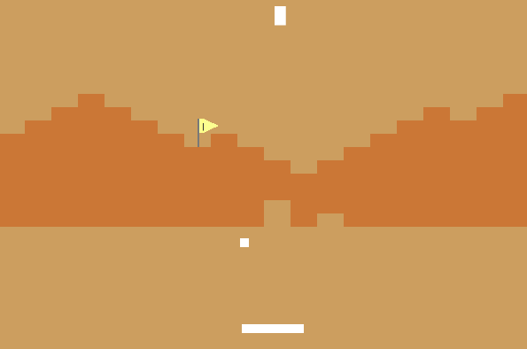
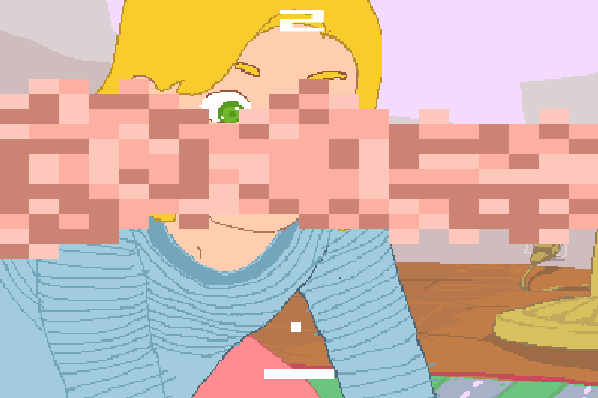
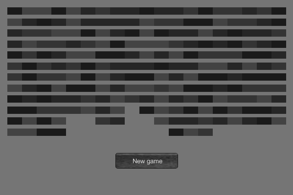
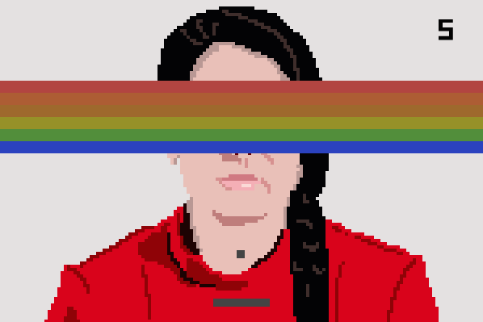
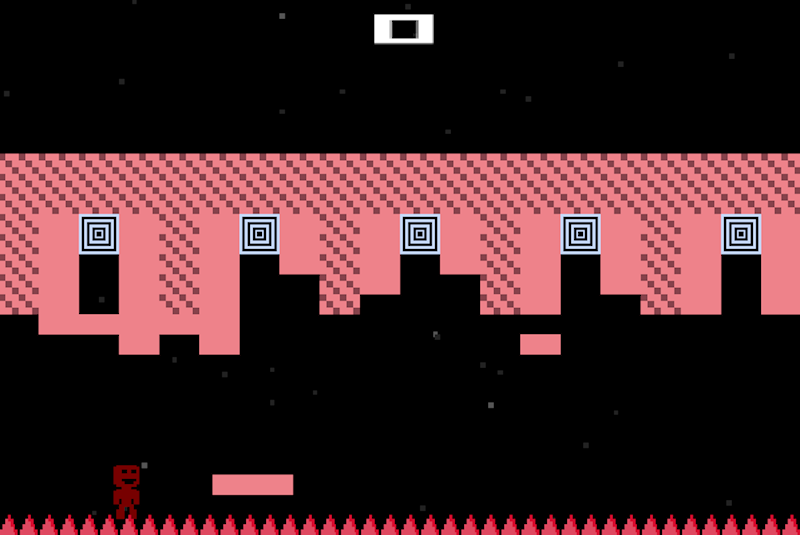

# Blog Posts

Here are public-facing blog posts I wrote about the game.

## Speaking Breakout (2015-12-15)

Over the last while I've been slowly managing to get back toward working on a new game, which is currently titled _Indie Bungle 2: The Breakout Indie Bungle!_ As might be apparent from the title, it's a sequel to the earlier _Mumble Indie Bungle_ and heavily involves trading on the game _Breakout_ again.

I've oscillated on the premise of the game a few times, trying to find out the kind of &#8216;truth' of the idea so that I can move forward confidently with design and implementation decisions and at this point I've either found that truth, or have become so frustrated with the &#8216;beautiful' &#8216;journey' of &#8216;discovery' that I've given up on it. You be the judge. The key oscillation has been between treating the game as quite a formal exercise in translation between _Breakout_ and these other games, versus the more &#8216;narrative' approach of adopting the pretence that the game has been created by a lazy cloning company that basically only has the technology to produce _Breakout_-likes. It may not surprise you to hear that the latter won the competition. In no small part because it's easier. (And truer?)

With that said, this idea of &#8216;translation' is still at the core of what I'm finding interesting about the project in general. If you take an existing game like, say, _How Do You Do It?_, how do you re-represent that game's ideas, message, feeling, etc. in the language of _Breakout_? _Breakout_ as a game has a very limited vocabulary – a ball that bounces, bricks that break, a paddle, a score, walls. The nature of the project becomes working out how to use these (or fudge them a bit) to &#8216;speak _How Do You Do It?'_ instead.

I kept getting stuck on ideas that ultimately revolved around just &#8216;reskinning' _Breakout_ to &#8216;look like' the other game but maintaining the exactly same mechanical experience, but it felt deeply unsatisfactory, so I've given myself more liberty to change some rules and layouts etc. to reach for a &#8216;more accurate' translation and it's been feeling a bit better since then. As often with game making, it amuses (and infuriates) me to be taking this whole thing so seriously, to really, really ask myself, repeatedly, what another game would be like if it were also, somehow, _Breakout_.

End.
Over the last while I've been slowly managing to get back toward working on a new game, which is currently titled _Indie Bungle 2: The Breakout Indie Bungle!_ As might be apparent from the title, it's a sequel to the earlier _Mumble Indie Bungle_ and heavily involves trading on the game _Breakout_ again.

I've oscillated on the premise of the game a few times, trying to find out the kind of &#8216;truth' of the idea so that I can move forward confidently with design and implementation decisions and at this point I've either found that truth, or have become so frustrated with the &#8216;beautiful' &#8216;journey' of &#8216;discovery' that I've given up on it. You be the judge. The key oscillation has been between treating the game as quite a formal exercise in translation between _Breakout_ and these other games, versus the more &#8216;narrative' approach of adopting the pretence that the game has been created by a lazy cloning company that basically only has the technology to produce _Breakout_-likes. It may not surprise you to hear that the latter won the competition. In no small part because it's easier. (And truer?)

With that said, this idea of &#8216;translation' is still at the core of what I'm finding interesting about the project in general. If you take an existing game like, say, _How Do You Do It?_, how do you re-represent that game's ideas, message, feeling, etc. in the language of _Breakout_? _Breakout_ as a game has a very limited vocabulary – a ball that bounces, bricks that break, a paddle, a score, walls. The nature of the project becomes working out how to use these (or fudge them a bit) to &#8216;speak _How Do You Do It?'_ instead.

I kept getting stuck on ideas that ultimately revolved around just &#8216;reskinning' _Breakout_ to &#8216;look like' the other game but maintaining the exactly same mechanical experience, but it felt deeply unsatisfactory, so I've given myself more liberty to change some rules and layouts etc. to reach for a &#8216;more accurate' translation and it's been feeling a bit better since then. As often with game making, it amuses (and infuriates) me to be taking this whole thing so seriously, to really, really ask myself, repeatedly, what another game would be like if it were also, somehow, _Breakout_.

End.

## Desert Breaking Out (2015-12-19)

Continuing pottering away on my _Indie Bungle 2_ over the last couple of days. I started out with a Breakout version of the excellent _[Desert Golfing](http://desertgolfing.captain-games.com/)_. It's been a very satisfying game to approach in this translation-to-Breakout project because it has such a distinctive visual style alongside its simplicity that fits quite well with "how Breakout speaks" I think.

Originally I'd planned to simply place bricks randomly on the screen to stand in for the idea of procedural level generation (though whether or how _Desert Golfing_ is (all) procedural is a fun matter of debate, or was last time I checked). But it didn't look quite right on the screen – funny, but not funny enough. Then I had the (deeply obvious) realisation that I could sculpt the wall of bricks to look like the terrain in the original game and it just looked so perfect I felt happy for a good couple of minutes.

Add that to the level resetting each time you hit the brick with the flag on it (the hole) and you have a surprisingly robust translation of (some of) _Desert Golfing_ into Breakout I think. Mechanically speaking, you still have to judge angles and distances in order to aim at the bricks you want to break, you still have endless procedural levels, you still have an ever-rising count of your strokes. It's really not too bad.

Now I've moved on to _[The Graveyard](http://tale-of-tales.com/TheGraveyard/)_ though, and that's proving significantly more challenging. (Which is interesting in itself.) Let's see how I go!

## How do you break out of it? (2015-12-22)

The _Indie Bungle 2_ continues apace, partly through my flitting between different translation in the bundle so as not to get stuck for too long on particular problems (like how to represent the song sequence in _[The Graveyard](http://tale-of-tales.com/TheGraveyard/)_?). I've moved over to making my _Breakout_ version of the excellent _[How Do You Do It?](http://ninasays.so/howdoyoudoit/)_ now.

A big part of my plans for this one initially revolved around the idea of not really making any changes at all to _Breakout_ per se because it has an amusingly &#8216;good fit' with _How Do You Do It?_ Both games are at some level about counting collisions and interpreting them, so I liked the idea of a straight up swapping of the meaning of collisions in _Breakout_ from points to "doing sex." Initially, in fact, I'd figured on simply presenting the game as straight-up _Breakout_ but perhaps with a palette reminiscent of _How Do You Do It?_ (Some pinks, blues, etc.)

However, realising that _How Do You Do It?_ is a Flash game specifically, I wanted to at least try out this whole thing of decompiling Flash to see the assets and scripts etc., as I'd never done it before. And doing that and seeing all the bits and pieces of the game (especially its very evocative sounds) made me think it would be fun to much more explicitly evoke the original in the _Breakout_ version by simply taking various visual and audio assets and dumping them in the _Breakout_ version. This seems like what my imaginary/speculative cloning company would do.

The results and so weirdly pleasing to me. As you play _Breakout_ you hear the clicks of the dolls and the occasional expressive sound as the girl's face changes expression behind the wall of bricks. Additionally, having copied the code for my _Desert Golfing_ version, I ended up with this terrain-shaped wall of bricks which, in the context of _How Do You Do It?_, ended up looking organic and appropriate to the nature of the game, so I exaggerated that with random pink hues (taken from the colouring of the dolls in the game) and a shaped bottom of the wall as well as top. It almost looks a bit crude actually, which is interesting to me – that a wall of _Breakout_ bricks could look crude.

And that's where I'm at. End of transmission.

## Ins and Outs: The Graveyard Bungle Edition (2015-12-23)

Part of the work of "translation" involved in the _Indie Bungle 2_ is naturally deciding which &#8216;bits' of a game you should explicitly represent (through _Breakout_ or around it) and which bits to leave to the side. For that matter you have to even decide what a &#8216;bit' of the game being translated is, and then how important or iconic it is, what it &#8216;does' in the frame of its game and so on.

So for example in my _Breakout_ version of [Tale of Tales](http://tale-of-tales.com/)&#8216; _[The Graveyard](http://tale-of-tales.com/TheGraveyard/)_ I don't include any representation of the little birds that flit around, but I do represent the tombstones you walk between on your way to the bench. I don't have the chapel behind the bench, but I do have the shadows of the clouds passing overhead. It's probably pretty arbitrary, by and large, or at least heavily based on my intuitions about what can make _Breakout_ feel like _The Graveyard_ while still feeling like _Breakout_.

The most interesting one lately has been thinking about how to represent and deal with the death of the old woman in the game, which is obviously central to the experience (and was famously something you had to "buy" in the real version). More generally, the question of what "death" is in _Breakout_ vis-a-vis _The Graveyard _is weirdly frustrating. Obviously if you lose all your paddles you "died" in some videogame sense, but death doesn't function that way in _The Graveyard_ at all, it just comes whether you want it to not and without warning (or may not come at all) – so you can't just make it happen as you could in _Breakout_ by missing on purpose. That's important: death isn't a matter of intention or skill (or lack of skill) in _The Graveyard _like it is in _Breakout_. (And since _The Graveyard_ is about death to some extent, it would be silly of me not to pay attention to that.)

So I implemented death in the same way as in _The Graveyard_: at a certain point your paddle may just fall off the screen (in the song sequence), kind of in reference to the woman's falling cane when she dies. And that's it – the ball then falls off the screen as well and doesn't reset. (Interestingly this means the song stops too, as it's triggered by brick collisions – something that isn't true of the original game.) As for _Breakout_&#8216;s "death", I simply removed it by having no paddle limit. After much struggling with the idea of how to represent choose (as the old woman) to leave the graveyard I realised I could just translate that by saying that you leave the graveyard when you literally quit the game (either back to the menu or altogether). Problem solved.

Finally, though, I remembered that a key experience with _The Graveyard_ and death is when the old woman has died and you quit and then restart the (not)game. It restores to where you were, with the woman still dead on the bench, and I felt like this idea was too important not to bring across as well – the "permanence" of death is key. So I added that in too, with the wall of bricks being restored as you left it and with no paddle or ball visible. Momento mori etc.

But then I also realised I needed the ability to start a new game if you died, as that's also in _The Graveyard_ (perhaps unfortunately? I can't quite decide if it would have been bolder and better to have permadeath in that game?). I solved this by replicating what feels like one of the only "missteps" in _The Graveyard_, which is the weird "New Game" button that appears on screen when you return to the dead woman. It seems so absurdly out of place, such a crass piece of user-interface in this delicate moment. As such, I literally took the button itself and pasted it into the _Breakout_ version, where it looks similarly inelegant.

I like that the inelegance carries that way.

## The Artist Is Breakout (2015-12-27)

Or should that be _The Breakout Is Present_? At any rate, today and yesterday's project has been making a translation of my early game _[The Artist Is Present](http://www.pippinbarr.com/2011/09/14/the-artist-is-present/)_ (based on the performance piece _[The Artist Is Present](http://www.moma.org/calendar/exhibitions/964?locale=en)_ by [Marina Abramović](http://www.mai-hudson.org/)) into _Breakout_. It's been surprisingly fun to work with materials of my own making, I guess especially because I feel freer in terms of interpreting what the game &#8216;means' and what a &#8216;good move' would be in the translation etc.

It's really been a process of entertaining realisations about what I could do with it more than anything else. First the idea was simply a straight-up _Breakout_ in which a screen of bricks would represent one queueing position, which you would then &#8216;advance' from by clearing the screen. Eventually you would reach a screen that was Marina's face hidden behind bricks, which I kept as-is as you can see in the screenshot above. (Just by the by, I think that image of the _[Police Quest](http://sarien.net/policequest)_-style rendering of Marina Abramović's face with her eyes hidden behind the traditional rows of _Breakout_ bricks may be the best visual composition I have ever created. But that's just me.)

I've been loosening up the nature of the _Indie Bungle 2_ project over time, and so the idea of clearing screens as queueing started feeling too vanilla, leading me to replace that idea with the bricks being the queue itself, each brick a person. Then I realised I could use the images of the people from the game as the bricks. Then I realised I could recolour them using the _Breakout_ brick colours as a call-back. Then I realised I could put Marina and the chairs at the top as something you break-through to in order to sit down. Then I realised the ball could move at such a speed that it recreated the queueing times in the original game (quite literally – I took the array of possible waiting times).

At some point I realised it would be amazing to have the first sequence in the game take place outside the museum, with the player having to bounce the ball through the doors of [MoMA](http://www.moma.org/). And of course then realised that MoMA would be shut when the real MoMA is shut (or rather, when it's shut in the original game), and the ball would just bounce off. Then I realised it would be great if when the doors do open for the ball, they reveal a little _Breakout_ wall of bricks just inside which you have to break through to get in.

I mean, _come on_. That is fun. God only know what it'll be like to actually go through, and once again I can only assume that nobody will ever reach the point of &#8216;sitting with' this new iteration of digital Marina...

But making it sure has felt a lot like playing.

## Flipping and Teleporting and Spikes, Oh My! (2016-01-07)

I've moved on to the last game in the _Indie Bungle 2_ which is a Breakout version of what might be my favourite game of all time, Terry Cavanagh's _[VVVVVV](http://thelettervsixtim.es/)_. I've actually been poking at this one for a while without much success, and I find the reason for that lack of success kind of interesting – I think it's because I'm so familiar with the game and so _into it_ that I've found it very hard to attain the simplicity and clunkiness required of these bungles.

_VVVVVV_ isn't the most complex game in the world in terms of what you do in it (flip up and down avoiding bad things and trying to get to good things), but it has such perfect details involved, and I keep finding myself wanting to preserve as many of them as possible in the Breakout version, even when it's been kind of detrimental to actually getting started. Notably, I spent a lot of time trying to think of how I could do something like the [Veni, Vidi, Vici](https://www.youtube.com/watch?v=4CtiY5D6HCs) section of the game in which you have to skilfully "fall" up and then down through a torturous sequences of screens. But it's just not really something I could make fit, even though it's iconic. Similarly for the [Tower](https://www.youtube.com/watch?v=B4-ZW-WQRZg) part of the game which involves a scrolling screen.

So I'm so fixated on all these great moments of play that I find I often can't think past them into the vague stupidity my own game essentially requires of me. The cloning company I'm playing in my head just _wouldn't_ pay tribute in the kind of way my heart wants to. They wouldn't include the lovely moving walkways or the [Gravitron](https://www.youtube.com/watch?v=qfy62WZzzps) or anything, just bricks breaking with stolen visuals and some basic nods to the structure of the "cloned" game. In short, my fictional company would do a _bad job_ of communicating _VVVVVV_ and it _hurts my feelings_ to do that, a first for me and game making.

Nonetheless, I trudge forward, hurting my feelings just for you.
